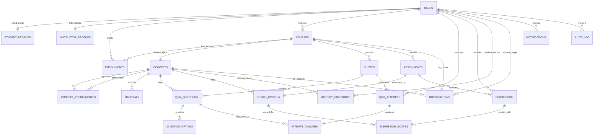
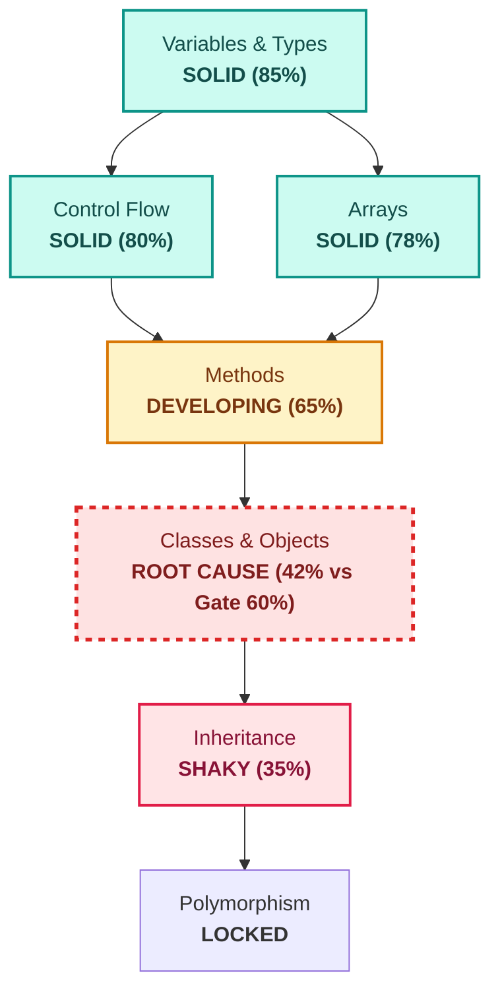

# Sopan LMS

> **Sopan** is a concept-graph learning management system that replaces linear modules with an adaptive directed acyclic graph (DAG) of prerequisites. Instead of monolithic grades, it computes continuous, recency-decayed mastery for every concept and pinpoints root-cause learning gaps automatically.

---

## Review 1 Demonstration Status

- [x] **Maven WAR Project:** Modular Jakarta EE 10 / Tomcat 10.1 architecture (`jakarta.servlet.*`).
- [x] **Complete Database Schema:** All 21 InnoDB tables, check constraints, foreign keys, cascade rules, composite indexes, and the unified `v_evidence` view (`sql/schema.sql`).
- [x] **Realistic Seed Data:** Seeded with *Object-Oriented Programming* (12 concepts linked in a prerequisite DAG), demo accounts, assessments, and mastery records (`sql/seed.sql`).
- [x] **Database Connectivity:** ConnectionProvider interface, DriverManagerProvider, and transactional unit-of-work manager (`TransactionManager`).
- [x] **Authentication & Role Authorization:** PBKDF2WithHmacSHA256 (600,000 iterations), session fixation protection, and path filters (`/learn/*`, `/teach/*`, `/admin/*`).
- [x] **Polymorphic Architecture:** Abstract `User` base class with concrete `Student`, `Instructor`, and `Admin` implementations dispatching home routes polymorphically without role branching.
- [x] **DAO Layer:** Generic `Dao<T, ID>` with pure JDBC implementations utilizing `PreparedStatement` and `try-with-resources`.
- [x] **Catalog & Safe Enrollment:** Course search, category/difficulty filtering, and capacity-safe enrollment protected by `SELECT ... FOR UPDATE` row-level locks.
- [x] **Showpiece Concept Map:** Server-rendered inline SVG concept map generated from topological DAG layers with color-coded mastery states.
- [x] **Hand-Crafted UI/UX:** Responsive CSS Grid design system with custom properties, warm off-white palette, deep ink text, and accessible 4-state mastery tokens.
- [x] **Core Engine Unit Tests:** Complete JUnit 5 test suite validating Kahn's topological sorting, levels, and cycle path detection in `ConceptGraphTest`.

---

## Technology Stack & Versions

- **Language:** Java 17 LTS
- **Web Runtime:** Apache Tomcat 10.1.x (Jakarta Servlet 6.0, Jakarta JSP 3.1, JSTL 3.0)
- **Database:** MySQL 8.0+ (InnoDB, `utf8mb4_unicode_ci`)
- **Build System:** Apache Maven 3.9+
- **Security:** Standard JDK `javax.crypto` (PBKDF2WithHmacSHA256, 600,000 iterations, 16-byte random salt)
- **Frontend:** Server-Rendered HTML5, Inline SVG, Hand-written CSS3 (No Bootstrap / No client-side JS charting dependencies)
- **Testing:** JUnit 5 (Jupiter 5.10.2)

---

## System Architecture

```
Browser (JSP Views + CSS + Pure Inline SVG)
        │
Filters (EncodingFilter, AuthFilter, RoleFilter, CsrfFilter)
        │
Servlets (Thin controllers extending BaseServlet)
        │
Services (Business rules, validations, transaction boundaries)
        ├─────────────────────────────┬─────────────────────────────┐
        ▼                             ▼                             ▼
Engine (Pure Java)           Concurrent (Background)          DAOs (Interfaces)
• ConceptGraph               • DeadlineScanner                • UserDao, CourseDao
• RecencyWeightedPolicy      • NotificationDispatcher         • MasterySnapshotDao
• RootCauseAnalyzer          • ConceptGraphCache              • EvidenceDao ...
• ActionRanker                                                      │
                                                                    ▼
                                                              JDBC Implementations
                                                              (JdbcUserDao, etc.)
                                                                    │
                                                                    ▼
                                                            TransactionManager
                                                                    │
                                                                    ▼
                                                            ConnectionProvider
                                                                    │
                                                                    ▼
                                                               MySQL 8 (InnoDB)
```

---

## Entity-Relationship Model (Spine Layout)



---

## Concept Graph & Root-Cause Analysis Example

The core pedagogical model arranges knowledge into a Directed Acyclic Graph (DAG). Mastery is gated: students cannot assess downstream concepts until all topological ancestors meet the course gate threshold (e.g. $60\%$).



**Diagnostic Output:**
> *"Inheritance is SHAKY because of Classes & Objects (mastery 42% vs gate threshold 60%)."*

---

## Setup & Deployment Instructions

### 1. Prerequisites
- JDK 17 installed (`java -version`)
- MySQL 8.0 Server running
- Apache Tomcat 10.1 installed
- Apache Maven 3.9+ installed

### 2. Database Initialization
Open MySQL client or MySQL Workbench:
```sql
SOURCE sql/schema.sql;
SOURCE sql/seed.sql;
```

### 3. Application Configuration
Copy the configuration template:
```bash
cp src/main/resources/db.properties.example src/main/resources/db.properties
```
Update `src/main/resources/db.properties` with your database credentials:
```properties
db.url=jdbc:mysql://localhost:3306/sopan?useSSL=false&allowPublicKeyRetrieval=true&serverTimezone=UTC
db.user=root
db.password=YourPasswordHere
storage.upload.dir=/var/sopan/uploads
```

### 4. Build & Package
Run the Maven package build (executes all unit tests):
```bash
mvn clean package
```
This produces `target/sopan.war`.

### 5. Deployment
Deploy `sopan.war` to Tomcat:
- Copy `target/sopan.war` into `$CATALINA_HOME/webapps/`
- Start Tomcat:
  ```bash
  $CATALINA_HOME/bin/startup.sh   # Linux/macOS
  %CATALINA_HOME%\bin\startup.bat  # Windows
  ```
- Open `http://localhost:8080/sopan/` in your web browser.

---

## Demo Accounts

All pre-seeded demo accounts share the password: `Password1!` (hashed via PBKDF2WithHmacSHA256, 600,000 iterations).

| Role | Name | Email | Default Dashboard |
| :--- | :--- | :--- | :--- |
| **Admin** | Priya Sharma | `admin@sopan.edu` | `/admin/home` |
| **Instructor** | Dr. Anand Verma | `anand.verma@sopan.edu` | `/teach/home` |
| **Instructor** | Dr. Kavita Nair | `kavita.nair@sopan.edu` | `/teach/home` |
| **Student** | Ravi Kumar | `ravi.kumar@sopan.edu` | `/learn/home` |
| **Student** | Meera Joshi | `meera.joshi@sopan.edu` | `/learn/home` |
| **Student** | Arjun Patel | `arjun.patel@sopan.edu` | `/learn/home` |

---

## Live Demonstration Checklist (Review 1)

1. **Responsive Landing Page:** Open `http://localhost:8080/sopan/` on desktop and inspect at phone-width ($375\text{px}$). Verify clean typography and navigation.
2. **Student Registration & Hashing:** Register a new student at `/register`. Query `SELECT email, password_hash, password_salt FROM users WHERE email = ?` in MySQL to confirm the 600k-iteration PBKDF2 hash.
3. **Role Authorization Guard (403):** While logged in as a student, attempt to access `/teach/home`. Verify that `RoleFilter` rejects the request with an HTTP `403 Forbidden` response.
4. **Catalog Discovery & Safe Enrollment:** Navigate to `/catalog`, filter by "Computer Science", open course preview, and click "Enroll". Observe the transactional capacity check.
5. **Showpiece Concept Map:** Navigate to `/learn/course/map?id=1`. View the inline SVG concept graph color-coded by mastery levels (`SOLID`, `DEVELOPING`, `SHAKY`, `UNSEEN`). Click on "Classes & Objects" to navigate to its concept page.
6. **Relational Schema Integrity:** Inspect MySQL Workbench reverse-engineered EER diagram to confirm the 21 InnoDB tables, foreign keys, and indexes.

---

## Project Roadmap

- [x] **Review 1:** Foundation, Schema, DAOs, Auth & Roles, Catalog, Concept Map SVG Showpiece, Responsive Layout, Core Engine Tests.
- [ ] **Review 2:** Interactive Assessments, Double-click Idempotency, Instant Evidence Pipeline, Rubric Grading, Gap Radar & Root Cause Engine, Today's 3 Moves.
- [ ] **Review 3:** Cohort Heatmap, Stalled Queue, Remedial Interventions, Asynchronous Notification Workers, Admin Moderation & Audit Logs, CSV Exports.
